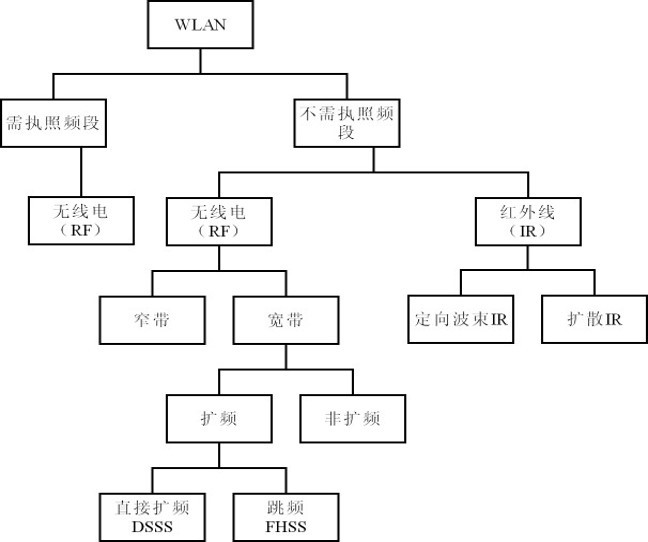

## 计算机网络

概述

物理层，信道容量，复用。

数据链路层，点对点，广播，以太网。

网络层，IP地址解析，子网，网际控制报文ICMP，路由网关，内部外部网关协议，VPN，NAT

运输层，UDP，TCP原理，可靠传输(碰撞)

应用层，域名系统，文件传输，万维网，电子邮件，DHCP，简单网管SNMP

网络安全，密码体系，数字签名，加密，防火墙

网络流媒体，交互式音视频通话

无线网络，WLAN，WPAN，WMAN

下一代互联网，IPv6，MPLS，P2P

## 网络工程

=企业实习+项目管理

概念和介绍，国际标准

需求分析，目标，时间约束，技术指标（可用可扩展安全可管理适应可购买）

基本构件，结点（网络专用计算机），链路（链路指无源的点到点的物理连接），Internet层次结构，中继器（物理层，LAN之间物理连接），集线器（多口中继器），网桥（连接地址兼容的网段），LAN交换机（使得LAN共享带宽端口互相分离），广域网交换机（。。），VLAN（使用交换机实现虚拟局域网），路由器（网络层，接受网络入口分组并从相应的端口转发出去），多层交换（提高路由器效率，加速，基于流或标签的选路），防火墙（不同网络之间的一系列部件的组合），VPN（虚拟专用网，基于IP加密隧道），访问服务器（为远程PC接入企业网服务），调制解调器（数模信号转换）。

广域网接入网技术，WAN技术，接入技术

逻辑网络设计，拓扑（平面层次网络园区企业网）、地址（IP地址规划）和选路（路由器协议IP选路）。

网络管理，网管功能（配置故障性能账户安全），远程监视，管理工具，平台

网络安全：加密数字签名防火墙密钥访问控制防火墙入侵检测备份容灾，解决方案

物理设计，结构化布线，机房和电源，以太网原理，选择技术和设备

网络测试、排错和性能优化，故障定位，故障排除，性能优化

### 我得换一个方法学习

## TCP/IP协议族

引言，发展史，协议标准，ISO，因特网，

OSI模型和协议族，编址(物理（链路）、逻辑、端口、特定应用)

底层技术，有线局域网（字面意思），无线局域网（。。），点到点广域网（通过公共电话网连接两个远程设备DSL点到点PPP），交换广域网（交换机连接局域网），连接设备（转发 集线器，网桥 两层交换机，路由器 三层交换机），

网络层，交换（中途路径许多判断），分组交换（报文被分割成便于管理的分组再发送），服务（有无连接），控制（差错、流量、拥塞、），

IPv4（32位），地址（A 1677W B 65526W C 256 D 多播 E 保留 类），数据报，

IP分组交付（直接间接 对分组的处理），转发（交付到下一站，下一跳 特定网络 特定主机方法），路由器（输入输出端口 选择处理器 交换结构-纵横榕树），

地址解析ARP（静态映射、动态映射，将IP地址和物理地址联系起来），网际控制报文协议ICMP（是网络层协议，差错报告报文 终点不可达 源点抑制 超时 参数问题 改变路由，查询报文 回送请求与回答 时间戳请求和回答 过时的报文），检验和。排错，ping

移动IP（固定主机、移动主机编址、两个地址、代理 归属代理 外地代理、），代理发现、登记、数据传送，移动ip低效，两次穿越，三角路由选择

单播路由选择协议（rip路由信息协议 距离向量路由选择 度量为跳数，ospf开放最短路径优先 划分为区域 主干区域 度量为代价 一个链接就是一条链路，bgp边界网关协议 自治系统AS 残桩 多归属 转接，报文 打开 更新 保活 通知），
协议|RIP|OSPF|BGP
--|-|-|-
类型|内部|内部|外部
路由算法|距离-向量|链路状态|路径-向量
传递协议|UDP|IP|TCP
路径选择|跳数最少|代价最低|较好，非最佳
交换结点|和本结点相邻的路由器|网络中所有的路由器|和本结点相邻的路由器
交换内容|当前本路由器知道的全部信息，即自己的路由表|与本路由器相邻的所有路由器的链路状态|首次：整个路由表；非首次：有变化的部分

多播路由选择协议（一对多，广播，多播地址，MOSPF，多播开放最短通路优先，多播距离向量路由组合，PIM协议无关多播），

运输层,用户数据报UDP（无连接不可靠，进程到进程通信），传输控制协议TCP（连接可靠，进程到进程，流交付服务，全双工通信，复用和分用）编号系统流量差错拥塞控制 三向握手 数据传送 连接终止 连接复位 状态转换图 累计确认ACK 选择确认SACK 产生确认 重传 FSM有限状态机 计时器 TCP软件包 传输控制块TCB，流控制传输协议SCTP（新的 可靠 面向报文 多重流 多重归属 全双工 面向连接 可靠 分组 确认号 块 SCTP关联 关联终止 异常终止 发送方 发送数据块 生成SACK块），

应用层，客户-服务器范式，套接字接口socket interface，运输层接口，STREAM主机，P2P范式，配置DHCP（同网络UDP 67 68，不同的网络 中继代理 TFTP 差错控制 分组格式），域名系统DNS（主机文件，名字空间 平面 层次，域名空间 完整域名 不完整域名，根服务器，主次服务器，类属域，国家域，反向域，解析程序，名字←→地址的映射，递归解析 迭代解析 高速缓存 DNS报文 封装 注册机构 DDNS），远程登入TELNET（分时环境 网络虚拟终端NVT 嵌入 选项 对称性 子选项协商 服务器控制 转义字符 操作方式 用户接口），SSH（2 四部分 运输层 鉴别 连接 应用 端口转发），

文件传送FTP（控制连接 数据连接，通信，命令，文件传送，匿名FTP），和TFTP（五种报文，RRQ,WRQ,DATA,ACK,ERROR，），

万维网,HTTP（web客户端-浏览器，web服务器，URL-HTTP，web文档，静态文档，动态文档（动态网关接口CGI）活动文档Java小程序 JavaScript HTTP事务 请求报文 请求行 报文的首部行 报文实体 响应报文 状态行 首部行，有条件请求，持续连接 cookie 代理服务器），

电子邮件 报文传送代理SMTP（情况 同一服务器用户 不同服务器 广域网间接连接 连接读取 用户代理 发送邮件 接收邮件 地址），读取代理pop（邮局协议版本3 TCP 110 ），IMAP（类似 功能更强 检查首部 搜索 多媒体 更名 层次文件夹），mime（多用途因特网邮件扩充：支持更多语言， 版本 类型 传输编码，标识，描述），

网络管理SNMP（管理器manager、代理器agent，smi协议定义，mib关联类型，名字，类型基本编码规则），

多媒体（流式储存直播交互式的音视频，音视频压缩 预测编码 感知编码），方法 使用万维网服务器，元文件，媒体服务器，媒体服务器和rtsp，多播 转换 混合，实时传输协议RTP，RTCP，发送方报告，接收方报告，源点描述报文，再见报文，特定应用报文 H.323 流量整形 漏桶算法 权标桶算法 资源预留 许可控制 综合服务

IPv6（128b 16byte 单播 任播 多播 自动配置 重新编号），协议（逐跳选项 Pad1 PadN 特大有效载荷 分片 鉴别）， ICMPv6（网际控制报文吧啦吧啦）差错报文 终点不可达报文 分组太大报文 超时报文 参数问题报文 信息报文 回送请求 回送回答 邻站发现报文 路由器询问报文 通告报文 改变路由报文 反向邻站询问通告报文 组成员关系报文 成员关系报文  功能性，

安全性，加密（密钥加密方法 替代加密方法 置换加密方法 流和块加密方法 数据加密标准DES RSA加密系统 加密散列函数 数字签名 实体鉴别 口令 查问响应），因特网安全（网络层安全 IP安全 运输方式 隧道方式 鉴别首部 封装安全有效载荷，安全关联，因特网密钥交换 VPN，运输层安全 安全套接层 握手协议 电子邮件安全 PGP证书 S/MIME），防火墙（分组过滤的 代理的 ），

## Oracle 数据库

基础部分去考数据库三四级就行了,别吧啦吧啦了.

SQL语句优化:

1. 尽量不使用*
2. 编码风格一致
3. 用truncate代替delete
4. 及时commit
5. 用exists代替in和distinct
6. 用union all代替 union
7. 尽可能减少对表的查询
8. 使用表的别名
9. 不要使用having子句实现where的功能

SQL表级优化:

1. 将数据量最小的表作为驱动表
2. 多个连接的查询,过滤掉最多记录的条件放前面
3. 合理使用索引
4. 避免使用like
5. where避免使用is (not) null
6. 避免大表查询 order by使用单行函数或者算数表达式

## 无线网络

这玩意就是通信原理啦

天线 偶极 抛物,地天直线,衰减损耗,模拟数字

扩频 直接 跳频 跳时技术

WLAN-IEEE802.11

802.15 蓝牙 IrDa HomeRF UWB Zigbee

802.16 QoS WiMAX

802.20 3G/4G 卫星通信 .20类似LTE

Ad Hoc网络 自组织自愈网络 功率控制 传感器尘埃 滞空回线

无线传感器网络WSN 空闲接听 数据冲突 串扰 控制开销 能量高效 可扩展 鲁棒性 快速收敛 能量感知 基于查询 地理位置 可靠 路由协议

无线mesh 最后一公里 802.11s

RFID 射频识别 物联网 T2T H2T H2H 和WSN融合

